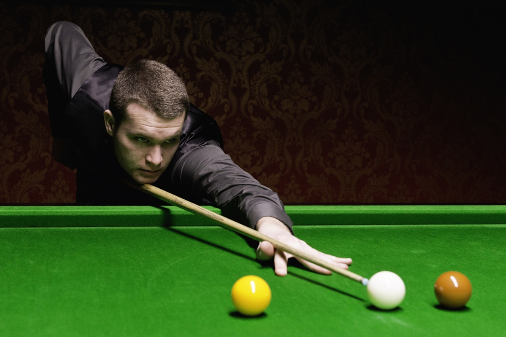

```{r setup, include=FALSE}
# The R code that is embedded in this Rmarkdown file is included in "chunks": This is the first chunk of R code.  Chunks are light grey in colour, whereas regular text (your prose) has a white background. 
knitr::opts_chunk$set(echo = FALSE)
source("solutions_assignment0.R") #this is what makes the objects you created in your R code available for inclusion in this document.
```


Students must abide by  [UVic
  academic regulations](https://www.uvic.ca/calendar/undergrad/index.php#/policy/Sk_0xsM_V?bc=true&bcCurrent=08%20-%20Policy%20on%20Academic%20Integrity&bcGroup=Undergraduate%20Academic%20Regulations&bcItemType=policies)
 and observe standards of scholarly integrity
(i.e. no plagiarism or cheating). Therefore, this assignment must be
taken individually and not with a friend, classmate, or group. You are
also prohibited from sharing any information about the assignment with
others. I affirm that I will not give or receive any aid on this assignment 
and that all work will be my own. **put your name here**

Neoclassical economics attempts to predict behaviour on the basis of agents making rational choices. Even the least introspective economist would agree that humans do not always choose rationally.  Nevertheless most economists are comfortable modeling behaviour *as if* all individuals are rational. Why? In a lot of domains rational choice does a good job of predicting behavior.  An analogy might be helpful.  If we were to try to predict the shots an expert billiards player makes, one model of behaviour could be based on the billiards player being an expert in Newtonian physics. 

{ width=50% }

Such a model would do a great job of predicting play, even though it is the wrong model of behaviour. Billiards players become expert by constantly practicing billiards, not by studying Newtonian physics. Similarly, experienced market participants make choices that *look like* they are determined by rational choice. What I am trying to get at here is a model is useful if it predicts behaviour accurately, even if its assumptions are clearly wrong. 

Experiment 0 is a test of rationality in an environment with which you likely have little experience.  You were asked to choose a number between 0 and 100 inclusive. You were told that the *target* was going to be $\frac23$ times the average choice within the class, and whoever chose the number closest to the target would win \$20. Presumably you like money, and \$20 is enough for you to think briefly about what choice would make it more likely you would win... What is the largest number you could choose? Thus, what is the highest possible *average* choice? What would the target be in that case? ...So 67 would *always* be closer to the target than 68 or above because $\frac23\times$ average(choice) will *always* be lower than 66.67. i.e. a choice of 67 dominates (is always better than) all choices between 68 and 100.\footnote{When subjects play this game repeatedly with feedback, choices of 68 and above quickly become rare.}

In experiment 0 there were three treatments, to which subjects were randomly allocated on the basis of their student ID. In one of the treatments the placeholder in the box in which you entered your choice was "your choice".  In the other two treatment the placeholder was either "50" or "33". A completely rational subject would not be influenced by this placeholder if he believed that everyone else in the class is also completely rational.  If everyone is completely rational and everyone knows this, then in all three treatments everyone should/would choose zero... Why? 

In contrast, if not everyone is completely rational then you could probably imagine how the placeholder could influence behavior: e.g. suppose some subjects would choose a number randomly between 0 and 100 in the "your choice" treatment, but when faced with a placeholder of "50" would instead choose "50".  By setting the placeholder to "50", we might be able to discourage these irrational choices, without limiting your freedom to choose whatever number you wish. This type of manipulation of the choice environment is known as a [*Nudge*](https://yalebooks.yale.edu/book/9780300122237/nudge). Here are histograms of the choices made in the three treatments.


```{r first_chunk, fig.height=5.5}
first_plot
```


There `r ifelse(length(winners)>1, paste0("were ",length(winners)," students who were"), paste0("was ",length(winners)," student who was"))` closest to the target: `r paste(winners,sep=",")` (I will be contacting you shortly to arrange payment). Regarding the treatment variable, it looks like the nudge might have been a bit too subtle. Next semester I will compare treatments "your choice" and "can't win if choice > 67". 

This is not to say that *all* of economics is based on the assumption of rationality.  There is an entire field of economics (behavioural economics) devoted to cataloging the systematic differences we see between human decision making and that of a perfectly rational agent. The goal of environmental policy is to alter behaviour in a way to reduce damages to the environment.  Taking into account these irrationalities *may* lead to better policy outcomes. 

# (O marks)

**If you have not done it already, read the first 4 chapters of [R for Data Science](https://r4ds.had.co.nz/)**

# (O marks)

**Try to figure out what each line of code in solutions_assignment0.R achieves.  You can find out information about functions by typing `?x`, where `x` is the function name, in the console, located bottom left panel of Rstudio. Info about that function is then shown in the bottom right panel of Rstudio.**

# (O marks)

**Try to figure out what solutions_assignment0.Rmd does.**
